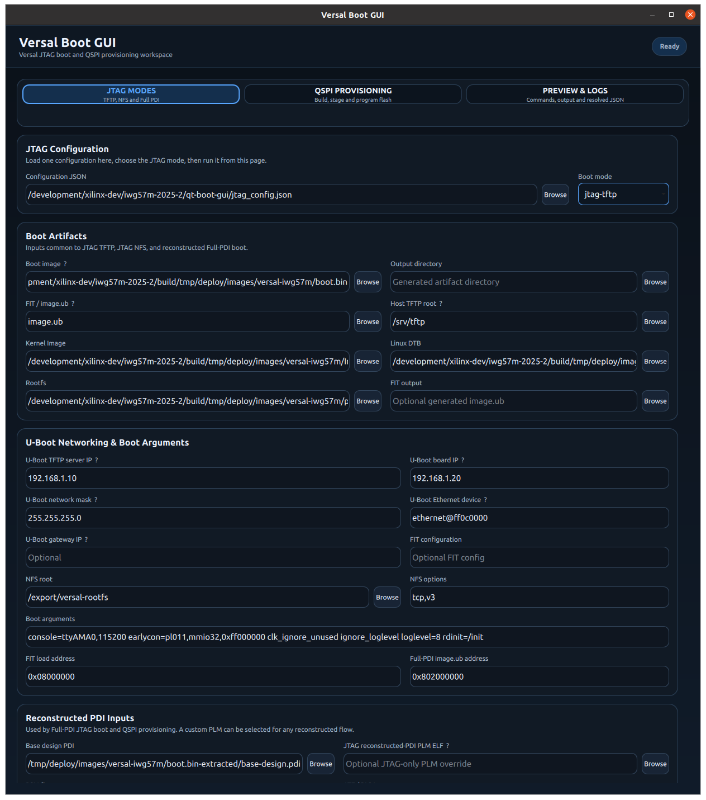
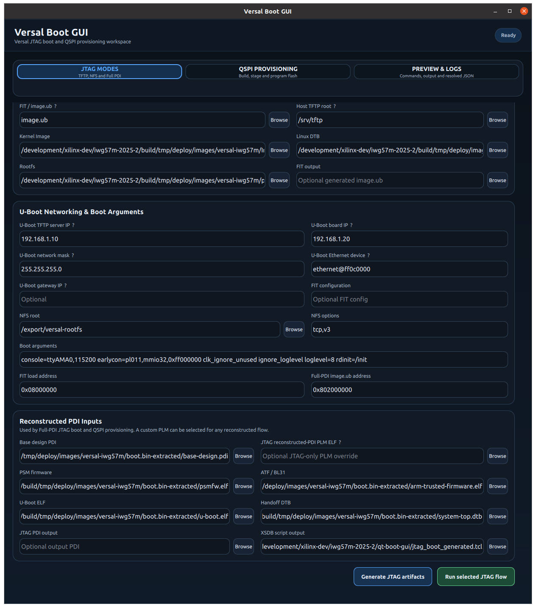
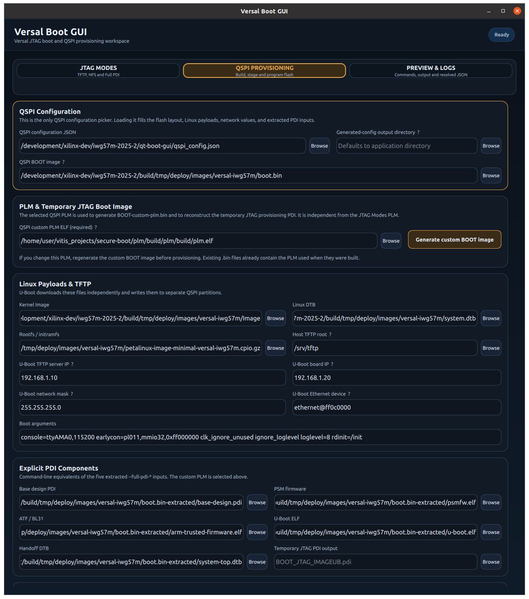
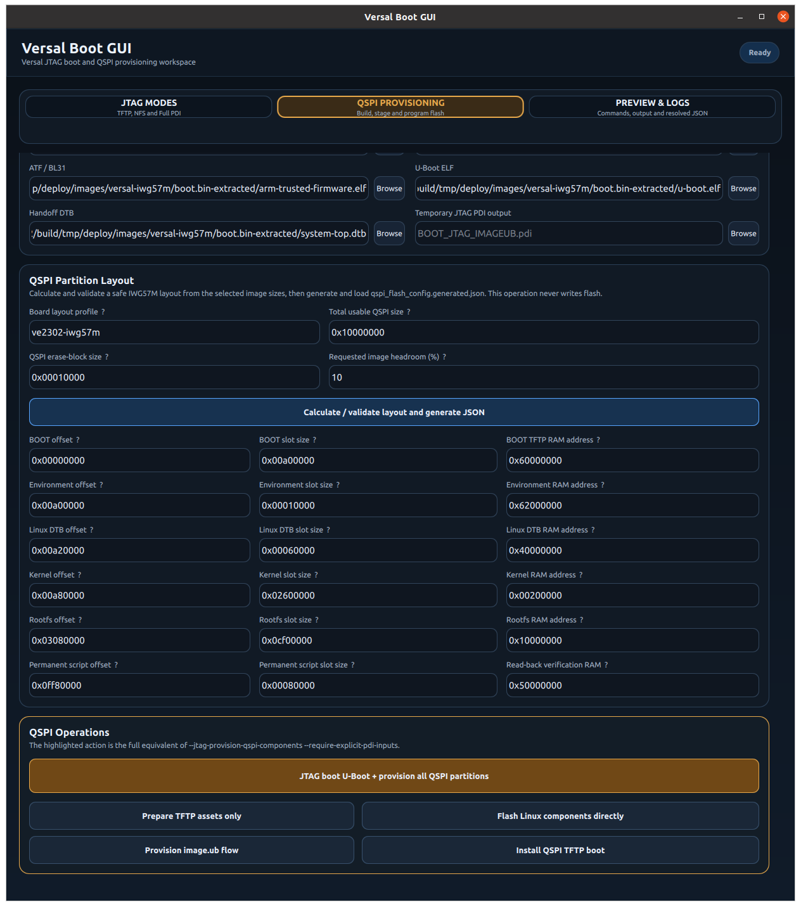
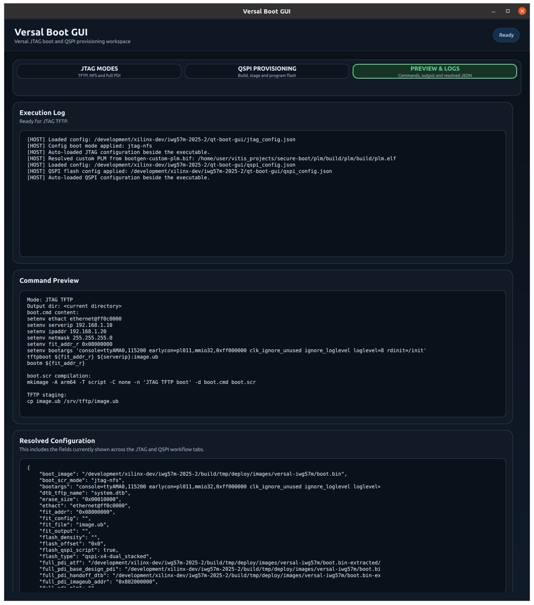
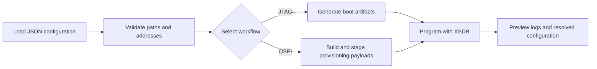

# Versal Boot GUI

[Website](https://kethort.github.io/iwave-g57m-lab/) | [Container image](https://github.com/kethort/iwave-g57m-lab/pkgs/container/iwave-g57m-lab) | [Documentation](docs/container-setup.md)

A Qt/QML workspace for Versal JTAG boot and QSPI provisioning. It replaces the
interactive command-line boot flow with configuration-driven forms, artifact
validation, generated command previews, and live execution logs.

The public release contains a stripped Linux x86-64 executable and its container
packaging. C++ and QML source code are maintained separately.

<p align="center">
  
</p>

<details>
<summary><strong>More interface screenshots</strong></summary>

### JTAG Inputs And Execution



### QSPI Inputs



### QSPI Layout And Operations



### Preview And Logs



</details>

## Highlights

- Boots Versal targets through JTAG TFTP, JTAG NFS, or reconstructed Full PDI.
- Builds custom-PLM BOOT images and temporary JTAG provisioning PDIs.
- Calculates and validates QSPI partition layouts from selected payload sizes.
- Stages kernel, DTB, rootfs, environment, and boot scripts for U-Boot TFTP.
- Streams `mkimage`, `bootgen`, and `xsdb` output into a copyable execution log.
- Loads separate JTAG and QSPI JSON configurations at startup.

## Workflow



The interface is organized around three pages:

| Page | Purpose |
| --- | --- |
| **JTAG Modes** | Configure and run TFTP, NFS, and Full-PDI boot flows. |
| **QSPI Provisioning** | Build a custom boot image, validate flash layout, and provision QSPI. |
| **Preview & Logs** | Review generated commands, tool output, and resolved JSON. |

## Quick Start

Requirements:

- Linux x86-64 with X11 or XWayland
- Docker Engine
- AMD Vitis 2025.2 installed on the host
- A host TFTP service and writable TFTP root
- A Versal target connected through JTAG

Build the image from this repository:

```bash
./build-image.sh
```

Or use the published image:

```bash
docker pull ghcr.io/kethort/iwave-g57m-lab:latest
export IMAGE_NAME=ghcr.io/kethort/iwave-g57m-lab:latest
```

Point the launcher at Vitis, your artifact workspace, and the host TFTP root:

```bash
export VITIS_SETTINGS=/development/2025.2/Vitis/settings64.sh
export WORKSPACE="$HOME/versal-lab-data"
export TFTP_ROOT=/srv/tftp

QT_BOOT_GUI_CHECK_ONLY=1 ./run-container.sh
./run-container.sh
```

The launcher starts host `hw_server` when needed, mounts Vitis read-only, maps
`WORKSPACE` to `/work`, and displays the containerized GUI through X11. Vitis is
not included in the image.

## Documentation

| Guide | Contents |
| --- | --- |
| [Container setup](docs/container-setup.md) | Vitis discovery, mounts, startup checks, and launching the GUI |
| [JTAG workflows](docs/jtag-workflows.md) | TFTP, NFS, Full-PDI boot, and target diagnostics |
| [QSPI provisioning](docs/qspi-provisioning.md) | Custom PLM images, flash layout, staging, and provisioning |
| [U-Boot environment](docs/u-boot-environment.md) | Persistent boot selection, QSPI environment layout, and verification |
| [Configuration](docs/configuration.md) | Startup JSON files, container paths, and generated output |
| [Troubleshooting](docs/troubleshooting.md) | X11, Vitis, hw_server, TFTP, and path failures |
| [Release process](docs/releasing.md) | Container publication, Pages deployment, and checksums |

## Safety

Review the selected flash device, capacity, erase size, partition offsets, and
payload paths before programming QSPI. The handoff DTB used by the temporary
JTAG-booted U-Boot must enable and describe the QSPI controller and flash. Verify
that U-Boot's `sf probe` succeeds and reports the expected device before allowing
an erase or write. Its compiled environment offset and size must also match the
GUI's QSPI environment partition. Do not interrupt power or JTAG while a flash
erase, write, or verification operation is active.

## Licensing

The application dynamically links Qt. License texts and third-party notices are
under [`LICENSES/`](LICENSES/). AMD Vitis is not redistributed; users provide
their own licensed Vitis installation at runtime.
