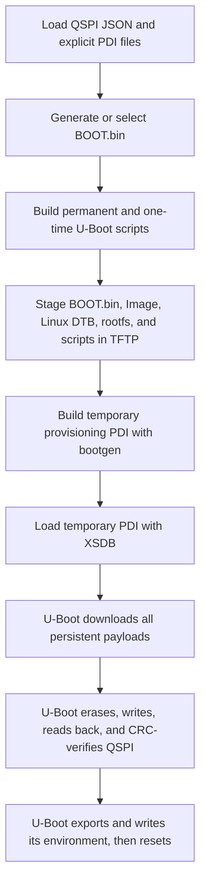

# QSPI Provisioning

The **QSPI Provisioning** page supports persistent flash operations. Its
complete provisioning action recreates the former
`--jtag-provision-qspi-components` flow: a temporary PDI starts U-Boot over
JTAG, then U-Boot downloads and writes the permanent QSPI contents.


## Two Images With Different Jobs

The complete flow uses two boot images that must not be confused:

| Image | Contents and purpose | Lifetime |
| --- | --- | --- |
| `BOOT-custom-plm.bin` (or selected QSPI `BOOT.bin`) | Permanent Versal boot image written at QSPI offset `0x0`. Its contents are defined by the original Yocto `bootgen.bif`; the custom build substitutes the selected QSPI PLM. | Persists in QSPI. |
| Temporary JTAG provisioning PDI, commonly `BOOT_JTAG_IMAGEUB.pdi` | Base design PDI, QSPI PLM, PSM, handoff DTB, TF-A, U-Boot, and the one-time `provision-qspi.scr`. | Loaded by XSDB for the current session only. It is not the image stored at QSPI offset `0x0`. |

The kernel, Linux DTB, rootfs, and permanent boot script are not embedded in
the temporary provisioning PDI. U-Boot downloads them from TFTP and writes them
to separate QSPI partitions.

## Tool Responsibilities

| Tool | Role in QSPI workflows |
| --- | --- |
| `mkimage -T script` | Converts each readable `.cmd` command list into a checksummed `.scr` U-Boot script image. |
| `bootgen` | Builds `BOOT-custom-plm.bin` from the Yocto BIF, or builds the temporary JTAG provisioning PDI from `qspi_provision.bif`. It constructs images only; it does not flash QSPI. |
| `xsdb` | Loads the temporary provisioning PDI over JTAG. In the complete flow, U-Boot then performs the QSPI writes. |
| `program_flash` | Performs direct host-driven persistent QSPI writes for the direct-flash, image.ub, and TFTP-boot install actions. |
| U-Boot `sf` commands | Probe, erase, write, read back, and verify QSPI during the complete JTAG-assisted provisioning flow. |
| `mkenvimage` | Builds a CRC-bearing environment image for the assets-only path. The complete provisioning flow instead uses the running U-Boot's `env export`. |

## Which File Defines Which Layout

“Partition” is used at several layers, but the layers are not interchangeable:

| Layer | Layout source | Builder/writer | Meaning |
| --- | --- | --- | --- |
| Permanent `BOOT.bin` internals | Yocto-extracted `bootgen.bif`, or generated `bootgen-custom-plm.bif` | `bootgen` | Boot-image partitions such as platform boot data, PLM, PSM, TF-A, and U-Boot. Exact contents come from the source BIF. |
| Temporary provisioning PDI | Generated `qspi_provision.bif` | `bootgen` | Components needed to start the temporary U-Boot session over JTAG, plus the provisioning script's RAM address. |
| FIT `image.ub` internals | `image.ub.its` | `mkimage -f` | Kernel, Linux DTB, ramdisk, hashes, and FIT configurations. Used only by the alternative single-FIT flow or FIT-based JTAG modes. |
| Physical QSPI map | QSPI JSON offsets and slot sizes | U-Boot `sf` commands or host `program_flash` | Persistent byte ranges for BOOT, environment, Linux DTB, kernel, rootfs, and boot script. |

Bootgen is therefore used to construct boot containers, but **Bootgen does not
lay out the separate Linux files in QSPI**. The QSPI JSON defines those
physical offsets. The one-time U-Boot script applies them with `sf erase` and
`sf write`, or the direct-flash actions pass them to `program_flash`.

### Temporary provisioning BIF layout

The complete JTAG-assisted action generates a BIF equivalent to:

```text
the_ROM_image:
{
    image
    {
        { type=bootimage, file=<base-design.pdi> }
        { type=bootloader, file=<qspi-custom-plm.elf> }
        { core=psm, file=<psmfw.elf> }
    }
    image
    {
        id=0x1c000000, name=apu_ss
        { type=raw, load=0x1000, file=<system-top.dtb> }
        { core=a72-0, exception_level=el-3, trustzone, file=<bl31.elf> }
        { core=a72-0, exception_level=el-2, file=<u-boot.elf> }
        { type=raw, load=0x20000000, file=<provision-qspi.scr> }
    }
}
```

Bootgen turns this recipe into the temporary PDI consumed by XSDB. There is no
kernel, Linux DTB, rootfs, or permanent `BOOT.bin` payload in this BIF. Once
U-Boot is running, it obtains those files from TFTP and writes the physical
QSPI map.

### When Bootgen runs

| GUI operation | Bootgen use |
| --- | --- |
| **Generate custom BOOT image** | Yes. Builds `BOOT-custom-plm.bin` from `bootgen-custom-plm.bif`. |
| **JTAG boot U-Boot + provision all QSPI partitions** | Yes. It may first generate the custom BOOT image, then always builds the temporary provisioning PDI from `qspi_provision.bif`. |
| **Prepare TFTP assets only** | Only if a custom BOOT image must be generated automatically; otherwise no. |
| **Flash Linux components directly** | Only if a custom BOOT image must be generated automatically; the persistent writes themselves use `program_flash`. |
| **Provision image.ub flow** | Only if a custom BOOT image must be generated automatically. `mkimage`, not Bootgen, creates `image.ub` and `boot.scr`. |
| **Install QSPI TFTP boot** | Only if a custom BOOT image must be generated automatically; the persistent writes use `program_flash`. |

## Required Source Files

### Permanent QSPI boot image

- A source Yocto `boot.bin`.
- Its extracted BIF, normally
  `boot.bin-extracted/bootgen.bif` next to the source image.
- The QSPI-specific custom `plm.elf`, when replacing the stock PLM.

### Temporary provisioning PDI

- Base design PDI (`base-design.pdi` or selected equivalent).
- QSPI custom PLM ELF.
- PSM firmware ELF.
- ATF/BL31 ELF.
- U-Boot ELF.
- Handoff DTB, normally extracted `system-top.dtb`.
- Generated one-time `provision-qspi.scr`.

### Persistent Linux partitions

- Uncompressed kernel `Image`.
- Linux `system.dtb`.
- Rootfs/initramfs image, normally a `.cpio.gz`.
- Generated permanent `qspi-boot.scr`.
- Generated persistent U-Boot environment.

The handoff DTB in the temporary PDI configures hardware for firmware and
U-Boot. The Linux `system.dtb` is a different file written to the Linux DTB
partition and passed to the kernel.

## Generating `BOOT-custom-plm.bin`

**Generate custom BOOT image** does not invent a new boot layout. It preserves
the source Yocto boot recipe and replaces its PLM entry:

1. The GUI locates `boot.bin-extracted/bootgen.bif` beside the selected source
   `boot.bin`.
2. It copies the BIF to `bootgen-custom-plm.bif` in the output directory.
3. It replaces `file=plmfw.elf` or `file=plm.elf` with the selected absolute
   QSPI custom PLM path.
4. It runs:

```bash
bootgen -arch versal -image bootgen-custom-plm.bif \
  -w -o BOOT-custom-plm.bin
```

The command runs with the original BIF directory as its working directory so
the other relative file references still resolve. The resulting binary
contains the partitions named by that BIF, typically the platform boot data,
PLM, PSM firmware, TF-A, and U-Boot. Inspect the actual BIF when an exact
partition inventory is required.

The BIF is only a host-side recipe. The board receives the generated
`BOOT-custom-plm.bin`, not the BIF. Changing the QSPI PLM requires regenerating
and reflashing the BOOT image. The JTAG-page custom PLM is a separate setting
and does not modify this QSPI image.

## U-Boot Command And Script Files

The GUI intentionally keeps `.cmd` and `.scr` as separate artifacts:

- `.cmd` is readable U-Boot shell text.
- `.scr` is that text wrapped in a U-Boot legacy script-image header with
  metadata and checksums.

Each conversion uses:

```bash
mkimage -A arm64 -T script -C none \
  -n "<script name>" -d <input.cmd> <output.scr>
```

The `.scr` is not a compiled CPU executable. U-Boot verifies the image header
and executes the contained commands with `source` or the board's configured
autoboot path.

### Permanent `qspi-boot.cmd` / `qspi-boot.scr`

This script is stored in the QSPI script slot and can be used by a boot
environment that loads and sources it. It:

1. Sets kernel, DTB, and rootfs RAM addresses.
2. Sets their QSPI offsets and exact payload sizes.
3. Sets the resolved Linux `bootargs`.
4. Runs `sf probe`.
5. Reads the three independent payloads from QSPI into RAM with `sf read`.
6. Starts Linux with
   `booti <kernel> <rootfs-address>:<rootfs-size> <dtb>`.

The complete all-partitions flow installs an equivalent `qspiboot` command
directly in the persistent environment, so that particular environment does
not need to load or source `qspi-boot.scr`. The script remains a generated,
flashed artifact for explicit script-based boot paths and recovery use.

### One-time `provision-qspi.cmd` / `provision-qspi.scr`

This script is embedded in the temporary JTAG PDI at `0x20000000`. It:

1. Sets U-Boot Ethernet, TFTP, RAM-work-area, partition offset, and slot-size
   variables.
2. Probes QSPI with `sf probe` and exits on failure.
3. TFTP-downloads `BOOT.bin`, `Image`, `system.dtb`, the rootfs, and permanent
   `qspi-boot.scr` into separate RAM addresses.
4. Records each `${filesize}`, checks expected Linux payload sizes, and
   calculates a RAM CRC.
5. Erases and writes the kernel, DTB, rootfs, and permanent boot-script slots.
6. Reads every written payload back and compares its CRC.
7. Writes and verifies `BOOT.bin` **last**, reducing the chance that an earlier
   payload failure destroys the previously bootable image at offset `0x0`.
8. Creates the persistent environment with the running U-Boot, writes and
   verifies its QSPI slot, and resets the board.

## Complete JTAG-Assisted Provisioning

Use **JTAG boot U-Boot + provision all QSPI partitions** for the operation that
matches the former Python command with
`--jtag-provision-qspi-components --require-explicit-pdi-inputs`.



### Host-side preparation

The GUI first validates the fixed IWG57M partition offsets and verifies that
each file fits its configured slot. It generates and stages:

| TFTP file | Destination in the complete flow |
| --- | --- |
| Selected/generated `BOOT.bin` | QSPI BOOT slot, normally offset `0x00000000`. |
| `Image` | Kernel partition. |
| Linux `system.dtb` | Linux DTB partition. |
| Rootfs/initramfs | Rootfs partition. |
| `qspi-boot.scr` | Permanent script partition. |
| `provision-qspi.scr` | Also staged for inspection/manual use; the active copy is embedded in the temporary PDI. |

### Temporary PDI construction

The GUI writes `qspi_provision.bif`. Its APU image includes the handoff DTB at
`0x1000`, TF-A at EL3, U-Boot at EL2, and `provision-qspi.scr` at
`0x20000000`. It then runs:

```bash
bootgen -arch versal -image qspi_provision.bif \
  -w -o <temporary-jtag-pdi>
```

### JTAG handoff and actual flash write

The generated `program_qspi_provision.tcl` connects to the configured
`hw_server`, selects the PMC, resets the system, and runs:

```tcl
device program "<temporary-jtag-pdi>"
```

`xsdb` ends after handing execution to the temporary image. From that point,
watch the serial console: **U-Boot**, not XSDB or Bootgen, performs the TFTP
downloads and `sf erase`/`sf write`/`sf read`/CRC operations.

## Persistent U-Boot Environment

The complete operation creates the environment with the same U-Boot binary
that will later consume it:

- `bootcmd=run $modeboot`
- `modeboot=qspiboot`
- `qspiboot`, containing `sf probe`, three `sf read` commands, `bootargs`, and
  the final `booti`
- resolved `bootargs`
- networking and layout variables established during provisioning

U-Boot runs `env export -c -s <slot-size> <RAM-address>` to create the
CRC-protected binary representation, then erases, writes, reads back, and
CRC-verifies the environment slot.

The U-Boot build must use a compatible SPI-flash environment backend and the
same location and size. Review settings such as `CONFIG_ENV_IS_IN_SPI_FLASH`,
`CONFIG_ENV_OFFSET`, `CONFIG_ENV_SIZE`, flash bus/chip-select settings, and any
redundant-environment configuration. The GUI writes one environment slot.
See [U-Boot environment](u-boot-environment.md) for validation commands and the
behavior of every GUI operation.

## Other QSPI Operations

The buttons are not aliases for the complete flow:

| Operation | Files and tools used | Result |
| --- | --- | --- |
| **Prepare TFTP assets only** | Generates permanent and staging `.cmd`/`.scr` files, creates `qspi-env.txt`, attempts `mkenvimage` for `qspi.env`, and copies BOOT, Linux payloads, scripts, and environment to TFTP. | No `bootgen` provisioning PDI, XSDB, `program_flash`, or QSPI write. Treat `qspi.env` as valid only when `mkenvimage` succeeded. |
| **Flash Linux components directly** | Generates permanent `qspi-boot.scr`, then invokes `program_flash` separately for BOOT, kernel, Linux DTB, rootfs, and script at their configured offsets. Each call uses the selected BOOT image with `-pdi` and connects to `hw_server`. | Persistent component layout, but no new persistent environment. |
| **Provision image.ub flow** | Generates a TFTP-to-QSPI `boot.scr`, stages `image.ub`, and uses `program_flash` to write BOOT and that script. | On execution, the script TFTP-downloads one FIT, writes it to the configured FIT slot, and boots it; if TFTP fails it tries the existing QSPI FIT. It does not use separate kernel/DTB/rootfs partitions. |
| **Install QSPI TFTP boot** | Requires JTAG TFTP mode, generates the normal TFTP `boot.scr`, optionally stages `image.ub`, and uses `program_flash` for BOOT and optionally the script. | Persistent BOOT plus a network-oriented script; the existing/default environment must select that script or boot path. |
| **JTAG boot U-Boot + provision all QSPI partitions** | Uses both `bootgen` and `xsdb` for the temporary boot, followed by U-Boot TFTP and `sf` commands. | Complete separate-partition layout plus persistent environment. |

`program_flash` is the direct host-flashing path. The GUI supplies the target
file, offset, flash type, optional density, selected BOOT image through `-pdi`,
and the `hw_server` URL. These direct operations do not use the generated XSDB
TCL from the complete flow.

## Device Tree And U-Boot Requirements

The QSPI controller and flash must be enabled in the **handoff DTB used by the
temporary JTAG-booted U-Boot**, normally extracted `system-top.dtb`. Enabling
QSPI only in the Linux `system.dtb` is not sufficient for provisioning.

The handoff DTB must describe the board-appropriate controller status, pinctrl,
clocks, flash child node, compatible string, chip select, bus width, frequency,
and stacked/parallel topology. U-Boot must include matching SPI-controller and
SPI-flash drivers plus the commands used by the scripts:

- `sf probe`, `sf erase`, `sf write`, and `sf read`;
- Ethernet and `tftpboot`;
- `crc32`, `test`, and environment export support;
- `source`/legacy script-image support;
- `booti` for the separate component layout;
- `bootm` and FIT support for the alternative `image.ub` layout.

### Check QSPI From U-Boot

U-Boot is the authoritative place to debug the provisioning path because the
temporary JTAG image runs U-Boot and U-Boot performs the `sf` operations. Stop
autoboot and begin with non-destructive commands:

```text
help sf
help fdt
help dm
printenv fdtcontroladdr
```

`fdtcontroladdr` is the address of the control device tree used by U-Boot's
driver model. Configure that address as the working FDT for these read-only
inspection commands, then print its aliases:

```text
fdt addr ${fdtcontroladdr}
fdt print /aliases
```

On the U-Boot build used by this project, `fdt addr -c` only reports the
control-FDT address; it does not configure the working address consumed by
`fdt print`. That produces `No FDT memory address configured` if no working FDT
was already selected. Do not use `fdt set`, `fdt rm`, or other modifying
commands while inspecting the control tree.

Find the alias or node path corresponding to the QSPI/SPI controller, then
print that node. The exact path is platform-dependent; do not assume a generic
`/spi@...` address:

```text
fdt print <qspi-controller-node-path>
```

If `/aliases` contains a suitable alias, U-Boot can dereference it by omitting
the leading slash. For example, if `spi0` points to the QSPI controller:

```text
fdt print spi0
```

If there is no alias, use `fdt list /` to begin walking the tree and then print
the controller by its full node path.

Verify that the controller has `status = "okay"` (or no `status` property),
and that it contains the expected flash child node. Check the child's
`compatible`, `reg`/chip-select, `spi-max-frequency`, bus-width properties, and
stacked or parallel-flash properties against the board design.

Next, inspect U-Boot's bound devices:

```text
dm tree
```

Look for the QSPI/SPI controller and its SPI-NOR child. Some U-Boot builds also
provide these useful views:

```text
dm uclass spi
dm uclass mtd
mtd list
```

Commands that report `Unknown command` are simply not enabled in that U-Boot
build; `dm tree` and `sf probe` remain the primary checks. Finally, probe the
flash without modifying it:

```text
sf probe
```

A successful `sf probe` should identify the SPI-NOR device and report a
capacity consistent with the configured QSPI size and topology. Do not run
`sf erase`, `sf write`, or any destructive flash test until this succeeds.
If the board exposes multiple SPI buses and the default probe fails, use the
`seq` value shown by `dm uclass spi` and the flash child's chip select to probe
explicitly:

```text
sf probe <bus-seq>:<chip-select>
```

Do not guess these numbers; derive them from `dm uclass spi` and the DTB's
flash-child `reg` property.

Use the failure point to narrow the problem:

| Result | Likely problem area |
| --- | --- |
| No QSPI node, or the node is disabled | The wrong handoff DTB was included in the temporary PDI, or the DTB was built without the QSPI enablement. |
| Node is enabled, but no controller appears in `dm tree` | Missing U-Boot driver/Kconfig support, a failed driver bind/probe, or unresolved clocks, resets, pinctrl, or dependencies. |
| Controller appears, but `sf probe` fails | Flash child-node compatibility, chip select, bus width, frequency, stacked/parallel topology, pinmux, wiring, or power. |
| `sf probe` succeeds with the wrong capacity | Incorrect flash compatible/topology or only one device in a stacked/parallel arrangement was detected. Do not use the generated offsets yet. |
| `sf probe` succeeds with the expected device and capacity | Device-tree and basic U-Boot QSPI access are ready for the provisioning script. |

### Expected IWG57M Result

The verified IWG57M configuration produces these results:

- `/aliases` maps `spi0` to `/axi/spi@f1030000`.
- `dm tree` shows the probed `zynqmp_qspi` controller and a probed
  `jedec_spi_nor` child named `flash@0`.
- `dm uclass spi` reports sequence `0` for `spi@f1030000`.
- `mtd list` reports `nor0`, a `0x10000000`-byte NOR device with a
  `0x10000`-byte erase block.
- `sf probe` detects `mt25qu02g`, 256-byte pages, 64 KiB erases, and a total
  capacity of 256 MiB.

An empty `dm uclass mtd` result is not a failure in this build when `dm tree`
shows the SPI-NOR child, `mtd list` shows `nor0`, and `sf probe` succeeds. Those
three successful results demonstrate that the control DT node is present, both
drivers bound, and the flash responded to its identification command.

The verified DT MTD table names these ranges:

| MTD name | Range |
| --- | --- |
| `BOOT.bin` | `0x00000000` through `0x009fffff` |
| `env` | `0x00a00000` through `0x00a1ffff` |
| `dtb` | `0x00a20000` through `0x00a7ffff` |
| `Image` | `0x00a80000` through `0x0307ffff` |
| `rootfs.cpio.gz.u-boot` | `0x03080000` through `0x0ff7ffff` |

The DT reserves `0x20000` bytes for the named `env` partition, while the GUI
currently exports, erases, and writes a single `0x10000`-byte environment slot
at `0x00a00000`. The upper `0x10000` bytes are consequently reserved but unused
by this GUI. Confirm that the U-Boot build uses `CONFIG_ENV_OFFSET=0x00a00000`
and `CONFIG_ENV_SIZE=0x00010000`; do not assume the extra erase block is a
redundant environment unless U-Boot and the GUI are deliberately configured
for redundancy.

The DT output also leaves the final range `0x0ff80000` through `0x0fffffff`
unnamed. That is the GUI's raw `qspi-boot.scr` slot. U-Boot `sf` commands can
still erase, write, and read this range by numeric offset, which is what the
generated scripts do. It will not be available by an MTD partition name unless
a matching fixed-partition node is added to the DT. This does not prevent the
complete flow's environment from booting because its `qspiboot` command
contains the component reads and `booti` command directly.

### Check QSPI From Linux

Linux can provide a secondary hardware check after the board boots:

```bash
dmesg | grep -Ei 'qspi|spi-nor|spi|mtd'
find /sys/firmware/devicetree/base \( -iname '*qspi*' -o -iname '*spi*' \) -print
find /sys/bus/spi/devices -mindepth 1 -maxdepth 1 -print
cat /proc/mtd
ls -l /dev/mtd* 2>/dev/null
```

If `mtd-utils` is installed, this gives a more detailed inventory:

```bash
mtdinfo -a
```

For the verified IWG57M Linux DT, inspect the actual controller and flash-child
paths. Use `tr` to render NUL-separated DT strings as separate lines:

```bash
NODE='/sys/firmware/devicetree/base/axi/spi@f1030000'
FLASH_NODE="$NODE/flash@0"

if [ ! -d "$NODE" ]; then
    echo "ERROR: QSPI controller node is absent"
elif [ -r "$NODE/status" ]; then
    tr '\0' '\n' < "$NODE/status"
else
    echo "Controller status is absent, which means enabled"
fi

if [ ! -d "$FLASH_NODE" ]; then
    echo "ERROR: SPI-NOR child node is absent"
else
    tr '\0' '\n' < "$FLASH_NODE/compatible"
fi
```

Do not copy placeholder node names literally on another platform. Resolve its
paths with the preceding `find` command first. An absent `status` property on
an existing node normally means enabled; an absent node is an error. A
controller node in the live tree without an MTD device generally means the
Linux driver did not bind or the flash probe failed, so inspect `dmesg` for the
reason.

Linux uses the Linux `system.dtb`, not necessarily the handoff/control DTB used
by the temporary U-Boot PDI. Linux detection proves that the hardware and Linux
description can work, but it does **not** prove that the U-Boot handoff DTB or
U-Boot driver configuration is correct. Successful U-Boot `sf probe` is the
required check for this GUI's JTAG-assisted QSPI provisioning flow.

GUI offsets cannot make an undetected flash device usable.

## Layout And Safety

**Calculate / validate layout and generate JSON** uses payload sizes, erase
alignment, flash capacity, reserved boundaries, and configured headroom to
produce `qspi_flash_config.generated.json`. It loads the result into the QSPI
page but does not write flash and never overwrites `qspi_config.json` unless the
user explicitly chooses that output path.

The complete IWG57M all-partitions action currently requires this 256 MiB QSPI
map:

| QSPI content | Offset | Slot size | Produced from |
| --- | --- | --- | --- |
| Permanent `BOOT.bin` | `0x00000000` | `0x00a00000` | Selected or custom-PLM BOOT image. |
| U-Boot environment | `0x00a00000` | `0x00010000` | `env export` from the temporary U-Boot session. |
| Linux DTB | `0x00a20000` | `0x00060000` | Selected Linux `system.dtb`. |
| Kernel | `0x00a80000` | `0x02600000` | Selected uncompressed `Image`. |
| Rootfs/initramfs | `0x03080000` | `0x0cf00000` | Selected rootfs image. |
| Permanent U-Boot script | `0x0ff80000` | `0x00080000` | Generated `qspi-boot.scr`. |

The DT reserves `0x20000` for `env`, although the GUI uses only the first
`0x10000`; the remaining erase block is layout space, not another generated
file. Other slot padding serves the same purpose. Erases operate on configured
GUI slot sizes, while writes use the actual downloaded file sizes.

Review every offset and slot size against the physical flash. The complete
IWG57M provisioning action also enforces the expected board offsets and refuses
to run when they differ.


Monitor both **Preview & Logs** and the board serial console. Do not interrupt
power, JTAG, TFTP service, networking, or `hw_server` during erase/write/verify
operations.
