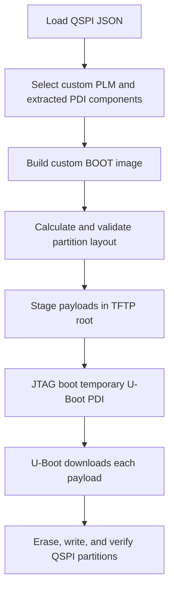

# QSPI Provisioning

The **QSPI Provisioning** page recreates the boot-and-provision operation that
was previously driven by `--jtag-provision-qspi-components` and explicit
`--full-pdi-*` arguments.

## Provisioning Path

The temporary JTAG image starts U-Boot. U-Boot then downloads BOOT.bin, kernel,
Linux DTB, rootfs, environment, and scripts over TFTP and writes each payload to
its configured QSPI partition.

## Required Inputs

- QSPI configuration JSON
- Base design PDI
- QSPI-specific custom PLM ELF
- PSM firmware
- ATF / BL31 ELF
- U-Boot ELF
- Handoff DTB
- Kernel image, Linux DTB, and rootfs/initramfs
- Host TFTP root and U-Boot network settings

The QSPI custom PLM is baked into the generated BOOT image. If the PLM changes,
regenerate the custom BOOT image before provisioning.

## Layout Generation

**Calculate / validate layout and generate JSON** uses payload sizes, erase
alignment, flash capacity, reserved boundaries, and configured headroom to
produce `qspi_flash_config.generated.json`. It loads the result into the QSPI
page but does not write flash and never overwrites `qspi_config.json`.

Review every offset and slot size against the physical flash before continuing.

## Operations

| Operation | Behavior |
| --- | --- |
| **Prepare TFTP assets only** | Generates scripts and stages payloads without running XSDB. |
| **Flash Linux components directly** | Uses host flash tooling for Linux payload partitions. |
| **Provision image.ub flow** | Installs the alternative single-FIT layout. |
| **Install QSPI TFTP boot** | Installs QSPI U-Boot configured to load Linux over TFTP. |
| **JTAG boot U-Boot + provision all QSPI partitions** | Runs the complete reconstructed-PDI and U-Boot provisioning flow. |

Monitor both **Preview & Logs** and the board serial console. Do not interrupt
power, JTAG, or networking during erase/write/verify operations.
