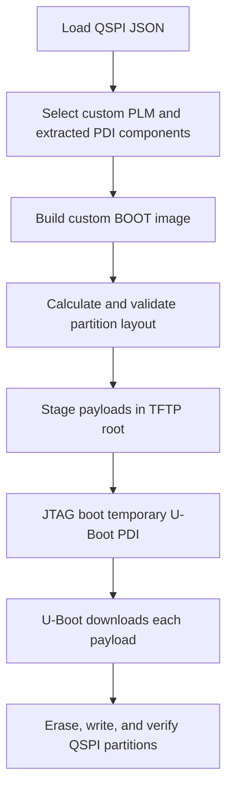

# QSPI Provisioning

The **QSPI Provisioning** page recreates the boot-and-provision operation that
was previously driven by `--jtag-provision-qspi-components` and explicit
`--full-pdi-*` arguments.


## Provisioning Path



The temporary JTAG image starts U-Boot. U-Boot then downloads BOOT.bin, kernel,
Linux DTB, rootfs, environment, and scripts over TFTP and writes each payload to
its configured QSPI partition.

## Required Inputs

- QSPI configuration JSON
- Base design PDI
- QSPI-specific custom PLM ELF
- PSM firmware
- ATF / BL31 ELF
- U-Boot ELF
- Handoff DTB
- Kernel image, Linux DTB, and rootfs/initramfs
- Host TFTP root and U-Boot network settings

The QSPI custom PLM is baked into the generated BOOT image. If the PLM changes,
regenerate the custom BOOT image before provisioning.

## Device Tree Prerequisite

The QSPI controller and attached flash must be enabled and correctly described
in the **handoff DTB used by the temporary JTAG-booted U-Boot**. This is commonly
the extracted `system-top.dtb` selected under **Explicit PDI Components**. It is
separate from the Linux `system.dtb` payload that is later written to QSPI, so
enabling QSPI only in the Linux device tree is not sufficient for provisioning.

The U-Boot device tree must provide the board-appropriate controller status,
pinctrl, clocks, flash child node, compatible string, chip-select, bus width,
frequency, and stacked/parallel topology. U-Boot must also be built with the
matching SPI controller and SPI flash drivers.

Before the first erase or write, interrupt U-Boot autoboot and run:

```text
sf probe
```

Proceed only when the command detects the expected QSPI device, capacity, and
topology. If it reports no controller or flash, correct the handoff DTB or U-Boot
driver configuration first. Changing GUI offsets cannot make an undetected QSPI
device available.

## U-Boot Environment Prerequisite

The U-Boot build must load its persistent environment from the same QSPI offset
and size configured under **QSPI Partition Layout**. The complete provisioning
operation exports the environment with the running U-Boot, writes it to that
slot, and installs `modeboot=qspiboot`. Other QSPI operation buttons do not all
replace the persistent environment and may depend on an existing or
compiled-default boot command.

Review [U-Boot environment](u-boot-environment.md) before choosing an operation,
especially when provisioning a blank device or changing the flash layout.

## Layout Generation

**Calculate / validate layout and generate JSON** uses payload sizes, erase
alignment, flash capacity, reserved boundaries, and configured headroom to
produce `qspi_flash_config.generated.json`. It loads the result into the QSPI
page but does not write flash and never overwrites `qspi_config.json`.

Review every offset and slot size against the physical flash before continuing.


## Operations

| Operation | Behavior |
| --- | --- |
| **Prepare TFTP assets only** | Generates scripts and stages payloads without running XSDB. |
| **Flash Linux components directly** | Uses host flash tooling for Linux payload partitions. |
| **Provision image.ub flow** | Installs the alternative single-FIT layout. |
| **Install QSPI TFTP boot** | Flashes QSPI U-Boot and its TFTP-oriented script; the existing/default environment must select that persistent path. |
| **JTAG boot U-Boot + provision all QSPI partitions** | Runs the complete reconstructed-PDI and U-Boot provisioning flow. |

Monitor both **Preview & Logs** and the board serial console. Do not interrupt
power, JTAG, or networking during erase/write/verify operations.
